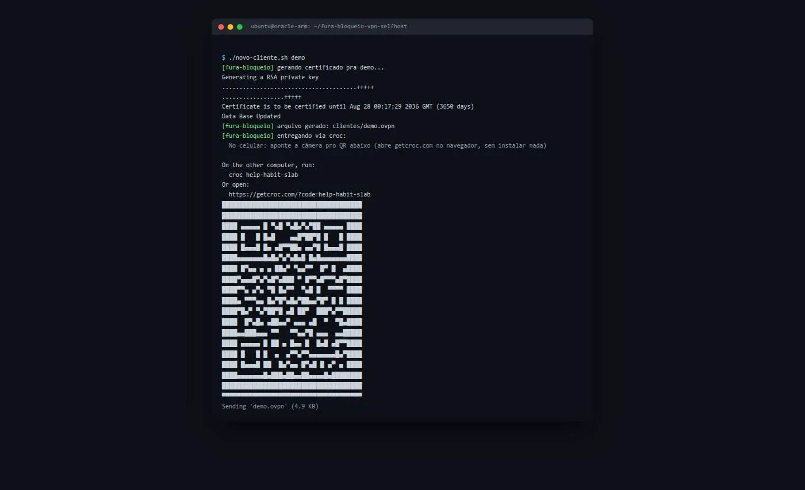
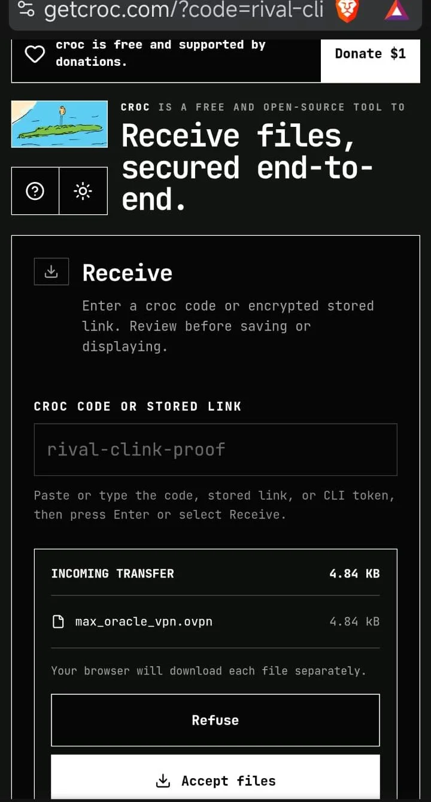
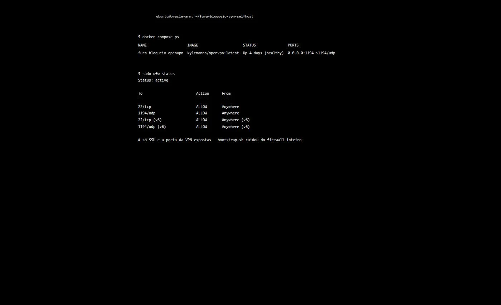

*Português | [English](README.en.md)*

# FuraBloqueio

VPN pessoal grátis, na sua própria VPS — não numa empresa de fora guardando log da sua navegação. Feito pra driblar a censura crescente no Brasil, sem mensalidade, rodando num free tier (Oracle Cloud, AWS, Google Cloud).

Se você sabe abrir um terminal e seguir um passo a passo, você consegue. É rápido.

## O que você ganha

Um arquivo `.ovpn` que você importa no app **OpenVPN Connect** (Windows, Mac, Linux, Android, iOS). No dia a dia é só abrir o app e apertar conectar/desconectar.

## Como instalar

1. Crie uma VPS free tier — veja as opções em [docs/ESCOLHER-VPS.md](docs/ESCOLHER-VPS.md) (recomendamos Oracle Cloud, grátis pra sempre).
2. Conecte por SSH e clone este repo:
   ```bash
   git clone https://github.com/maxh33/fura-bloqueio-vpn-selfhost.git
   cd fura-bloqueio-vpn-selfhost
   ```
3. Prepare a VPS inteira com um comando (firewall, atualizações, Docker, servidor VPN):
   ```bash
   sudo ./bootstrap.sh
   ```
4. Gere seu certificado e receba o arquivo no seu computador:
   ```bash
   ./novo-cliente.sh SEU_NOME
   ```
   A entrega usa [croc](https://github.com/schollz/croc) (MIT) — transferência ponta a ponta, sem porta aberta na VPS. Aponte a câmera do celular pro QR code que aparece no terminal ou rode o código impresso no seu computador.
5. Importe o `.ovpn` recebido no [OpenVPN Connect](https://openvpn.net/client/) e conecte.

Pronto — sem mensalidade, sem terceiro no meio do seu tráfego.

## Prints

Rodando `./novo-cliente.sh` numa VPS real: certificado gerado e entrega via croc, QR code pra escanear com o celular.



Recebendo o arquivo `.ovpn` no celular, direto do navegador, sem instalar nada:



Status do container e do firewall depois do `bootstrap.sh`:



## Dúvidas, outros comandos, detalhes de segurança?

Veja o [guia completo](docs/GUIA-COMPLETO.md).

## Licença

MIT — veja também o [aviso legal](docs/AVISO-LEGAL.md).
